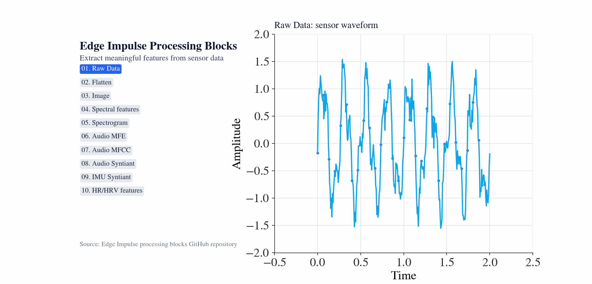
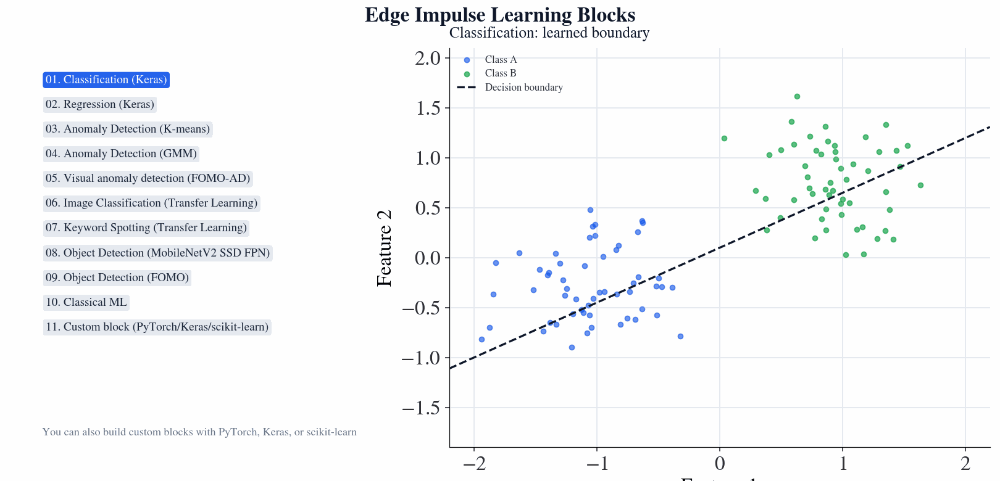

# Edge Impulse Concept Animations — ML + DSP GIF Toolkit

This repository provides a practical workflow for creating animated visualizations of machine learning and digital signal processing concepts.

It includes:

- Notebook explorations for rapid prototyping
- Python scripts for repeatable batch generation
- Ready-to-copy templates for creating your own concept animations
- A documented structure so contributors can quickly add new ideas

## Quick Start

### 1) Create environment

```bash
/opt/homebrew/bin/python3 -m venv .venv
source .venv/bin/activate
python -m pip install --upgrade pip
python -m pip install -r python/requirements.txt
```

### 2) Install gifsicle (optional, for optimization)

```bash
brew install gifsicle
```

### 3) Generate animations

```bash
python python/animation_pipeline.py --all
```

Generated files are written to `img/` and temporary frame PNGs to `scratch/`.

## Animation Presets

The script `python/animation_pipeline.py` includes these presets:

- `dsp_sine_shift` — moving sine-wave phase animation (DSP)
- `dsp_processing_blocks` — Edge Impulse processing blocks walkthrough (DSP)
- `dsp_processing_blocks_individual` — one standalone GIF per DSP processing block concept
- `nn_sigmoid_shift` — shifting activation curve animation (ML)
- `ml_learning_blocks` — Edge Impulse learning blocks walkthrough (ML)
- `ml_learning_blocks_individual` — one standalone GIF per ML learning block concept
- `sine_bead` — bead moving over a sine curve (concept intro)
- `gapminder_full` — complete Gapminder sequence using `gif`

Run one preset:

```bash
python python/animation_pipeline.py --preset dsp_processing_blocks
```

Run all presets:

```bash
python python/animation_pipeline.py --all
```

Generate one animation per DSP processing block:

```bash
python python/animation_pipeline.py --preset dsp_processing_blocks_individual
```

Generate one animation per ML learning block:

```bash
python python/animation_pipeline.py --preset ml_learning_blocks_individual
```

## GIF Previews

| Preset | Preview |
|---|---|
| `dsp_sine_shift` |  |
| `dsp_processing_blocks` |  |
| `nn_sigmoid_shift` |  |
| `ml_learning_blocks` |  |
| `sine_bead` |  |
| `gapminder_full` |  |

## Individual Block Previews + Concept Accuracy

Accuracy values below are current estimated concept-alignment scores based on visual faithfulness to the intended block behavior.

### DSP Processing Blocks

| Block | Preview | Concept Accuracy |
|---|---|---:|
| Raw Data |  | 97% |
| Flatten |  | 92% |
| Image |  | 88% |
| Spectral features |  | 95% |
| Spectrogram |  | 95% |
| Audio MFE |  | 94% |
| Audio MFCC |  | 93% |
| Audio Syntiant |  | 86% |
| IMU Syntiant |  | 90% |
| HR/HRV features |  | 89% |

### ML Learning Blocks

| Block | Preview | Concept Accuracy |
|---|---|---:|
| Classification (Keras) |  | 95% |
| Regression (Keras) |  | 95% |
| Anomaly Detection (K-means) |  | 97% |
| Anomaly Detection (GMM) |  | 97% |
| Visual anomaly detection (FOMO-AD) |  | 90% |
| Image Classification (Transfer Learning) |  | 92% |
| Keyword Spotting (Transfer Learning) |  | 91% |
| Object Detection (MobileNetV2 SSD FPN) |  | 93% |
| Object Detection (FOMO) |  | 92% |
| Classical ML |  | 88% |
| Custom block (PyTorch/Keras/scikit-learn) |  | 85% |

## Running the Notebooks

Each notebook can be run independently by opening it in Jupyter Notebook or JupyterLab and executing cells sequentially.

Main notebook:

- `notebook/animations_vis_animation.ipynb`

## Output

All generated animations are saved to the `img/` directory. Temporary PNG frames are written to `scratch/` for image-sequence workflows.

## Build Your Own Animation

Start from one of the templates:

- `python/templates/dsp_template.py`
- `python/templates/ml_template.py`

Then follow the contributor workflow in `docs/BUILD_YOUR_OWN.md`.

## Testing

Run automated tests:

```bash
python -m pytest -q
```

## Legacy Notebook Exports

The files below are preserved for compatibility/reference:

- `python/animations_vis_animation.py`
- `python/dsp_and_nn_animations_vis_animation (2).py`

They are notebook exports and not the recommended starting point for new contributions.
